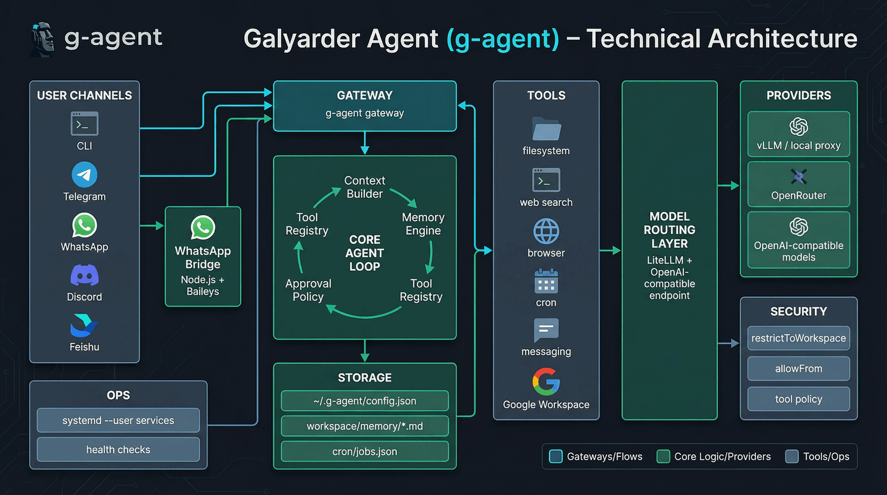

<div align="center">
  
  <h1>Galyarder Agent (g-agent)</h1>
  <p><b>Private, practical, always-on personal AI assistant for cross-platform workflows (Linux, macOS, Windows, and mobile via Telegram/WhatsApp).</b></p>
  <p>
    
    
    
    
  </p>
  <p>
    
    
    
    
  </p>
</div>

---

## Philosophy

`g-agent` is built with one clear philosophy:

- **Useful over flashy**: solve real daily tasks first.
- **Private over cloud-lock**: local workspace + local memory by default.
- **Minimal over bloated**: keep the stack lean and understandable.
- **Controllable over magical**: explicit tool policy, approvals, and allowlists.

If your assistant cannot run reliably on your own Linux machine, it is not your assistant.

---

## Architecture

<p align="center">
  
</p>

---

## Core Stack

| Layer | Stack |
|---|---|
| CLI & Runtime | `Python 3.11+`, `Typer`, `Rich`, `asyncio` |
| LLM Routing | `LiteLLM` + OpenAI-compatible endpoints (vLLM/local proxy/OpenRouter/others) |
| Channels | Telegram (`python-telegram-bot`) + WhatsApp bridge (`Baileys` + Node) are primary; Discord + Feishu are available (experimental) |
| Memory | Markdown-first memory files (`MEMORY.md`, `PROFILE.md`, `PROJECTS.md`, etc.) |
| Scheduling | Built-in cron service + proactive digest/lessons jobs |
| Integrations | Google Workspace (Gmail, Calendar, Drive, Docs, Sheets, Contacts), Slack webhook, SMTP |
| Safety | `restrictToWorkspace`, `allowFrom`, browser denylist, per-tool policy, approval mode |

---

## What You Can Do Today

- Chat via CLI, Telegram, and WhatsApp (Discord/Feishu available, experimental).
- Run local-proxy models (including Gemini-compatible routes) through OpenAI-compatible APIs.
- Save and recall durable memory automatically.
- Use web/browser tools (`browser_open`, `browser_snapshot`, `browser_click`, etc.).
- Access Google Workspace (email/calendar/files/docs/sheets/contacts) via OAuth.
- Schedule proactive reminders and daily/weekly assistant jobs.

---

## Install

### One-line install (by OS)

| OS | One-liner |
|---|---|
| Arch / Arch-based | `curl -fsSL https://raw.githubusercontent.com/galyarderlabs/galyarder-agent/main/deploy/arch/install.sh \| bash` |
| Debian / Ubuntu | `curl -fsSL https://raw.githubusercontent.com/galyarderlabs/galyarder-agent/main/deploy/debian/install.sh \| bash` |
| macOS | `curl -fsSL https://raw.githubusercontent.com/galyarderlabs/galyarder-agent/main/deploy/macos/install.sh \| bash` |
| Windows (PowerShell) | `irm https://raw.githubusercontent.com/galyarderlabs/galyarder-agent/main/deploy/windows/install.ps1 \| iex` |

Script-specific env flags:

- Arch: `G_AGENT_SKIP_PACMAN=1`, `G_AGENT_SKIP_SERVICES=1`, `G_AGENT_AUTO_START_SERVICES=0`
- Debian/Ubuntu: `G_AGENT_SKIP_APT=1`, `G_AGENT_SKIP_SERVICES=1`, `G_AGENT_AUTO_START_SERVICES=0`
- macOS: `G_AGENT_SKIP_BREW=1`, `G_AGENT_SETUP_LAUNCHD=1`, `G_AGENT_AUTO_START_SERVICES=0`
- Windows: `G_AGENT_SKIP_WINGET=1`, `G_AGENT_SETUP_TASKS=1`

Common flags (all installers):

- `G_AGENT_INSTALL_DIR=/path/to/repo` (default: `~/galyarder-agent`)
- `G_AGENT_DATA_DIR=/path/to/data` (default: `~/.g-agent`)

Installer scripts:

- `deploy/arch/install.sh`
- `deploy/debian/install.sh`
- `deploy/macos/install.sh`
- `deploy/windows/install.ps1`

### Uninstall (by OS)

| OS | One-liner |
|---|---|
| Arch / Arch-based | `curl -fsSL https://raw.githubusercontent.com/galyarderlabs/galyarder-agent/main/deploy/arch/uninstall.sh \| bash` |
| Debian / Ubuntu | `curl -fsSL https://raw.githubusercontent.com/galyarderlabs/galyarder-agent/main/deploy/debian/uninstall.sh \| bash` |
| macOS | `curl -fsSL https://raw.githubusercontent.com/galyarderlabs/galyarder-agent/main/deploy/macos/uninstall.sh \| bash` |
| Windows (PowerShell) | `irm https://raw.githubusercontent.com/galyarderlabs/galyarder-agent/main/deploy/windows/uninstall.ps1 \| iex` |

Uninstall flags:

- `G_AGENT_REMOVE_SERVICES=0` keep startup services/tasks
- `G_AGENT_REMOVE_REPO=1` remove repo directory
- `G_AGENT_WIPE_DATA=1` remove full `~/.g-agent` data

---

### From source (recommended)

```bash
git clone https://github.com/galyarderlabs/galyarder-agent.git
cd galyarder-agent/backend/agent
pip install -e .
```

### From PyPI (when published)

```bash
pip install galyarder-agent
```

> Note: package publication is pending; use source install for now.

---

## Quick Start

### 1) Initialize

```bash
g-agent onboard
```

Default data directory: `~/.g-agent`

### 2) Configure model provider

Edit `~/.g-agent/config.json`:

```json
{
  "providers": {
    "vllm": {
      "apiKey": "sk-local-xxx",
      "apiBase": "http://127.0.0.1:8317/v1"
    }
  },
  "agents": {
    "defaults": {
      "model": "gemini-3-pro-preview"
    }
  },
  "tools": {
    "restrictToWorkspace": true,
    "web": {
      "search": {
        "apiKey": "BSA-xxx"
      }
    }
  }
}
```

### 3) Chat

```bash
g-agent agent -m "Halo, siapa kamu?"
```

### 4) Check health

```bash
g-agent status
g-agent doctor --network
```

---

## CLI Commands

| Command | Purpose |
|---|---|
| `g-agent onboard` | Init config + workspace template |
| `g-agent agent -m "..."` | One-shot chat |
| `g-agent agent` | Interactive chat |
| `g-agent gateway` | Start channel gateway |
| `g-agent status` | Full runtime status |
| `g-agent doctor` | Diagnostics + fix hints |
| `g-agent feedback "..."` | Save lessons memory |
| `g-agent digest` | Generate daily digest |
| `g-agent proactive-enable` | Install default proactive jobs |
| `g-agent proactive-disable` | Remove default proactive jobs |
| `g-agent channels status` | Show channel config status |
| `g-agent channels login` | WhatsApp QR linking |
| `g-agent google configure/auth-url/exchange/verify` | Google OAuth flow |
| `g-agent cron add/list/remove/enable/run` | Scheduled jobs |

---

## Channel Setup

Supported channels and typical setup effort:

| Channel | Setup |
|---|---|
| Telegram | Easy (bot token + user ID allowlist) |
| WhatsApp | Medium (Node bridge + QR pairing) |
| Discord* | Medium (bot token + intents + invite URL) |
| Feishu* | Medium (app credentials + event subscription) |

`*` Experimental in current release.

### Telegram

```json
{
  "channels": {
    "telegram": {
      "enabled": true,
      "token": "BOTFATHER_TOKEN",
      "allowFrom": ["6218572023"]
    }
  }
}
```

### WhatsApp

```json
{
  "channels": {
    "whatsapp": {
      "enabled": true,
      "bridgeUrl": "ws://localhost:3001",
      "allowFrom": ["6281234567890"]
    }
  }
}
```

> For WhatsApp bridge, use Node.js 18+.

Pair WhatsApp:

```bash
g-agent channels login
```

Then in another terminal:

```bash
g-agent gateway
```

### Discord (experimental)

1. Create app + bot in Discord Developer Portal.
2. Enable **Message Content Intent** in bot settings.
3. Get your Discord user ID (Developer Mode → Copy User ID).
4. Invite bot with permissions like `Send Messages` and `Read Message History`.

```json
{
  "channels": {
    "discord": {
      "enabled": true,
      "token": "DISCORD_BOT_TOKEN",
      "allowFrom": ["YOUR_DISCORD_USER_ID"]
    }
  }
}
```

Run:

```bash
g-agent gateway
```

### Feishu / Lark (experimental)

1. Create app on Feishu Open Platform and enable **Bot** capability.
2. Add permission to send/receive IM messages.
3. Add event subscription for message receive using **Long Connection** mode.
4. Copy `appId` and `appSecret` to config.

```json
{
  "channels": {
    "feishu": {
      "enabled": true,
      "appId": "cli_xxx",
      "appSecret": "xxx",
      "encryptKey": "",
      "verificationToken": "",
      "allowFrom": []
    }
  }
}
```

Run:

```bash
g-agent gateway
```

> Feishu long-connection mode does not require public webhook hosting.

---

## Google Workspace (OAuth)

```bash
g-agent google configure --client-id "YOUR_CLIENT_ID" --client-secret "YOUR_CLIENT_SECRET" --calendar-id "primary"
g-agent google auth-url
# open URL, approve consent, copy value after ?code=
g-agent google exchange --code "PASTE_CODE"
g-agent google verify
```

Default scopes include:
- `gmail.modify`
- `calendar`
- `drive.readonly`
- `documents`
- `spreadsheets`
- `contacts.readonly`

---

## Memory Model

Memory lives inside `workspace/memory`:

- `MEMORY.md`: durable long-term notes
- `PROFILE.md`: user identity/preferences
- `RELATIONSHIPS.md`: people context
- `PROJECTS.md`: active and backlog project context
- `LESSONS.md`: behavior improvements and feedback
- `YYYY-MM-DD.md`: daily memory note

The agent can use `remember` and `recall` tools to write/read useful context across sessions.

---

## Security Model

Primary controls:

- `tools.restrictToWorkspace`: keep file/shell actions inside workspace.
- `channels.*.allowFrom`: whitelist chat users/numbers.
- `tools.policy`: per-tool `allow` / `ask` / `deny`.
- `tools.approvalMode`: `confirm` for risky tool calls.
- Browser denylist for localhost/metadata endpoints.

Recommended baseline for personal usage:

```json
{
  "tools": {
    "restrictToWorkspace": true,
    "approvalMode": "confirm"
  }
}
```

---

## 24/7 Service Mode (systemd --user)

```bash
systemctl --user enable --now g-agent-wa-bridge.service
systemctl --user enable --now g-agent-gateway.service
```

Check:

```bash
systemctl --user status g-agent-wa-bridge.service
systemctl --user status g-agent-gateway.service
```

Optional lingering:

```bash
sudo loginctl enable-linger "$USER"
```

---

## Docker Quick Run

From repo root:

```bash
docker build -t g-agent ./backend/agent
docker run -v ~/.g-agent:/root/.g-agent --rm g-agent g-agent onboard
docker run -v ~/.g-agent:/root/.g-agent --rm g-agent g-agent status
docker run -v ~/.g-agent:/root/.g-agent -p 18790:18790 g-agent g-agent gateway
```

---

## Guest Profile Isolation (Clone Assistant Mode)

`g-agent` supports isolated profiles using `G_AGENT_DATA_DIR`.

Example guest profile:

```bash
mkdir -p ~/.g-agent-guest
G_AGENT_DATA_DIR=~/.g-agent-guest g-agent onboard
G_AGENT_DATA_DIR=~/.g-agent-guest g-agent status
```

Each profile has isolated:
- config
- workspace/memory
- cron jobs
- media/bridge data
- OAuth/session artifacts

Use separate Telegram bot token and separate WhatsApp account for guest profile.

---

## Troubleshooting

### Telegram timeout

- verify internet/proxy
- check token:

```bash
curl -sS "https://api.telegram.org/bot<YOUR_TOKEN>/getMe"
```

### WhatsApp bridge reconnect loops

- rebuild bridge:

```bash
g-agent channels login --rebuild
```

- then restart services:

```bash
systemctl --user restart g-agent-wa-bridge.service g-agent-gateway.service
```

---

## Production Checklist

Use this checklist for stable 24/7 personal deployment.

### 1) Lock access

- Keep `channels.*.allowFrom` non-empty for every enabled channel.
- Keep `tools.restrictToWorkspace: true`.
- Keep `tools.approvalMode: "confirm"` (or stricter).
- Use a separate `G_AGENT_DATA_DIR` profile for guest/public assistants.

### 2) Monitor health

```bash
g-agent doctor --network
systemctl --user status g-agent-gateway.service g-agent-wa-bridge.service
journalctl --user -u g-agent-gateway.service -u g-agent-wa-bridge.service -n 120 --no-pager
```

### 3) Backup critical state

```bash
mkdir -p ~/.g-agent-backups
tar -czf ~/.g-agent-backups/g-agent-$(date +%F).tar.gz \
  ~/.g-agent/config.json \
  ~/.g-agent/workspace/memory \
  ~/.g-agent/cron
```

### 4) Rotate keys/tokens safely

```bash
NEW_TG_TOKEN='YOUR_NEW_TOKEN'
tmp=$(mktemp) && jq --arg v "$NEW_TG_TOKEN" '.channels.telegram.token = $v' ~/.g-agent/config.json > "$tmp" && mv "$tmp" ~/.g-agent/config.json
systemctl --user restart g-agent-gateway.service
```

```bash
NEW_BRAVE_KEY='YOUR_NEW_BRAVE_KEY'
tmp=$(mktemp) && jq --arg v "$NEW_BRAVE_KEY" '.tools.web.search.apiKey = $v' ~/.g-agent/config.json > "$tmp" && mv "$tmp" ~/.g-agent/config.json
systemctl --user restart g-agent-gateway.service
```

### 5) Upgrade safely

```bash
cd ~/galyarder-agent/backend/agent
pip install --no-deps -U --force-reinstall .
systemctl --user restart g-agent-wa-bridge.service g-agent-gateway.service
g-agent status
```

### 6) Run ops scripts

```bash
~/galyarder-agent/deploy/ops/healthcheck.sh
~/galyarder-agent/deploy/ops/backup.sh
```

---

## Acknowledgements

This project stands on the shoulders of open-source work:

- [`HKUDS/nanobot`](https://github.com/HKUDS/nanobot) — lightweight personal assistant foundation and practical CLI/channel ideas.
- [`openclaw/openclaw`](https://github.com/openclaw/openclaw) — broader agent architecture inspiration for memory, tooling, and personal assistant direction.

Huge respect to both communities and contributors.

---

## License

MIT — see `LICENSE`.

---

> “Digital sovereignty is not isolation — it is ascendancy with ownership: your memory, your tools, your systems, your future.”
