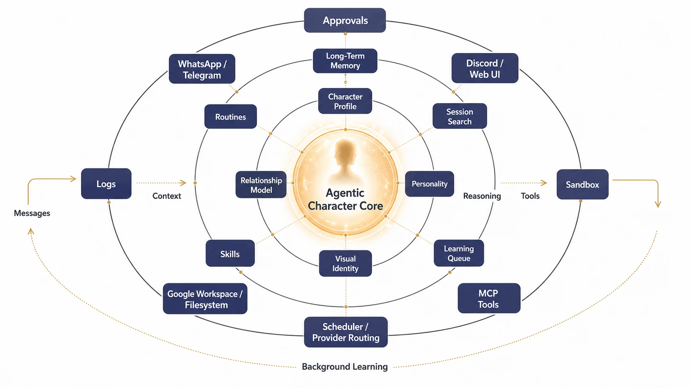

  <a class="gagent-card" href="channels/">
    <strong>Presence</strong>
    Give the same digital identity a home in WhatsApp, Telegram, Discord, Email, CLI, and future channel plugins.
  </a>
  <a class="gagent-card" href="configuration/#provider-registry">
    <strong>Continuity</strong>
    Carry memory, values, preferences, relationships, and projects across sessions instead of starting over.
  </a>
  <a class="gagent-card" href="configuration/#visual-identity--selfies">
    <strong>Visual Identity</strong>
    Generate contextual selfies and mirror shots through Hugging Face, Cloudflare, or OpenAI-compatible image proxies.
  </a>
  <a class="gagent-card" href="operations/">
    <strong>Action</strong>
    Let the character use scoped tools for files, shell, Gmail, Calendar, Drive, schedules, media, and workflow packs.
  </a>

## Start Here

1. [**Getting Started**](getting-started.md) — Rapid deployment guide.
2. [**Configuration**](configuration.md) — Dial in your providers and tools.
3. [**Channels**](channels.md) — Connect to the world.
4. [**Operations**](operations.md) — Master the agent loop.

## Architecture

<i>Execution path: channel input -> identity and memory context -> agent loop -> tools/scheduler -> response and learning loop.</i>

